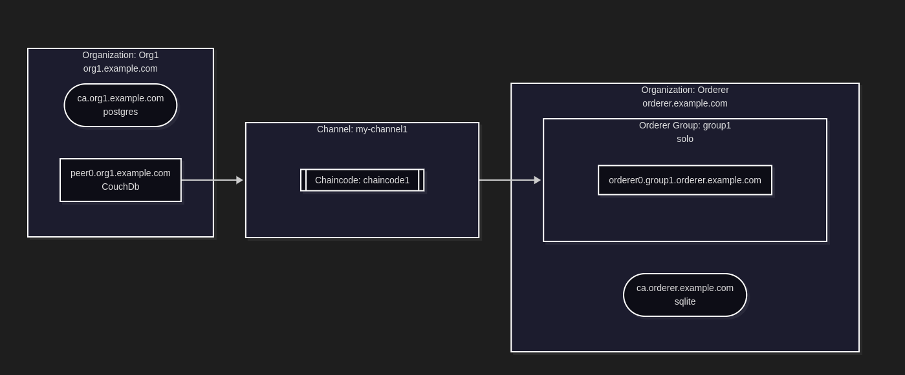

# LFX Fablo
## My LFX Mentorship Journey: Testing, Documentation, and Feature Parity for Fablo (Hyperledger Fabric v2/v3)
**LF Decentralized Trust | 2025 June–November (Part-Time)**

## About Fablo
### What is Fablo?

Fablo is a developer-friendly tool for quickly spinning up Hyperledger Fabric networks using Docker. It simplifies network configuration through a single declarative file, making it ideal for:

- **Local development** – Quickly test chaincode and network configurations
- **CI/CD pipelines** – Automate Fabric network deployment in testing environments
- **Experimentation** – Try different network topologies without complex manual setup

### Key Features of Fablo

- Supports **Hyperledger Fabric v2.x and v3.x**
- Multiple consensus protocols: **BFT, RAFT, and Solo**
- **Network snapshots** for saving and restoring network states
- **Chaincode-as-a-Service (CCaaS)** support
- **Java chaincode hot reload** (dev mode)
- **Mermaid-based network topology visualization**
- REST API integration and advanced topology configuration

---
## Mentorship Goals

The primary objectives of my mentorship were:

1. **Ensure feature parity between Fabric v2 and v3** – Verify that all features supported in Fabric v2 work correctly with Fabric v3, especially peer dev mode, network snapshots, and channel query scripts

2. **Improve test coverage** – Write and enhance end-to-end Bash tests and Jest tests for various network configurations

3. **Enhance documentation** – Identify and fill gaps in the existing documentation

4. **Fix issues** – Resolve minor bugs and issues discovered during testing

---
## My Journey

### Understanding Fablo

When I started this mentorship, I had no prior experience with Hyperledger Fabric or Fablo. I didn't know what Fablo was or what it did.

This mentorship was my first real introduction to blockchain network tooling and Hyperledger Fabric concepts.

#### My Learning Journey:
- Understanding Hyperledger Fabric from scratch: I spent time learning the fundamentals of Hyperledger Fabric: peers, orderers, channels, chaincode, and how enterprise blockchain networks operate
- Exploring Fablo's purpose: I discovered that Fablo simplifies the complex process of spinning up Fabric networks by using a single configuration file, which was eye-opening for understanding developer experience in blockchain
- Setting up the local development environment: Configured Docker, cloned the repository, and got Fablo running locally
- Studying Fablo's architecture: Explored how Fablo generates network configurations, manages Docker containers
- Running existing test suites: Executed Bash and Jest tests to understand the testing framework and current coverage
#### My First Contribution:
Early in my journey, I tackled an important issue that had been open: enabling cross-platform testing on macOS (Issue #217). This resulted in my first pull request:

> [feat: Add cross-platform testing on macOS #546](https://github.com/hyperledger-labs/fablo/pull/546)

This contribution allowed Fablo's test suite to run on different operating systems in GitHub Actions, improving the project's CI/CD pipeline and ensuring broader compatibility. Working on this issue helped me deeply understand Fablo's testing infrastructure and how CI workflows operate in open-source projects.

---

## Contributions
### Features 
#### Network Topology Visualization with Mermaid

> [feat: Export network topology with Mermaid #565](https://github.com/hyperledger-labs/fablo/pull/565)

**The Problem:**

Complex Hyperledger Fabric networks are difficult to visualize and understand from configuration files alone. Before this feature, Fablo could generate full Fabric networks, but the structure was only defined in YAML/JSON files which were hard to read, difficult to present to team members, and offered no way to visualize how components were connected.

**The Solution:**

I implemented a feature that automatically generates Mermaid diagrams from Fablo network configurations. Now, instead of parsing complex config files, users get a clear visual diagram showing the entire network topology.

Additionally, I enhanced this feature so that diagrams are generated by default with every `fablo generate` command ([#584](https://github.com/hyperledger-labs/fablo/pull/584)). The topology visualization is automatically created alongside the network configuration.

**Benefits:**

- Better Understanding: Visualize complex network relationships and see how all components (peers, orderers, channels, organizations) are connected at a glance
- Easier Reporting: Instead of embedding raw config files in reports, users can include clean, auto-generated diagrams
- Improved Communication: Share clear, always up-to-date topology diagrams with developers, operators, stakeholders, and newcomers
- Simplified Onboarding: New team members can quickly grasp the network architecture without deciphering configuration files
- Seamless Integration: Diagrams are now generated automatically with every `generate` command, requiring no extra steps

This feature transforms how teams understand, document, and communicate their Hyperledger Fabric network topologies.

---
#### Feature: Java Chaincode Development Mode Support

> [feat: Add Java chaincode development mode support #553](https://github.com/hyperledger-labs/fablo/pull/553)

**The Problem:**

During chaincode development, developers need to frequently modify and test their code. Without development mode, every change requires rebuilding and redeploying the chaincode container a slow and frustrating workflow. While Fablo already supported dev mode for other languages, Java chaincode developers didn't have this option.

**The Solution:**

I implemented Java chaincode development mode (hot reload) support in Fablo. This feature allows Java chaincode developers to run their chaincode outside of the peer container during development, enabling:

- Hot Reload: Make changes to Java chaincode and see them reflected immediately without restarting the entire network
- Faster Development Cycles: No need to rebuild and redeploy containers for every code change
- Easier Debugging: Run chaincode locally with full access to debugging tools and logs
- Consistent Experience: Java developers now have the same streamlined dev workflow as other chaincode languages

This significantly improves the developer experience for teams building Java-based smart contracts on Hyperledger Fabric

---
#### Simplified Init Generator

> [feat: Hardcode fablo config inside init generator #530](https://github.com/hyperledger-labs/fablo/pull/554)

**The Problem:**
The `fablo init` generator relied on an external JSON config file (__fablo-config-hlf2-1org-1chaincode.json__) that needed to be copied into the Docker image during the build process. This added unnecessary complexity to the Dockerfile and the initialization flow.

**The Solution:**
I simplified the init generator in `src/init/index.ts` by hardcoding the default configuration directly into the source code. This eliminated the need to copy external config files in the Dockerfile, resulting in a cleaner build process and more maintainable codebase.

---

---
### End-to-End Bash Tests

### Jest Tests

### Bug Fixes 

### Documentation Improvements

---

## Outcomes and Deliverables

**E2E Bash tests** verifying Fabric v3 features (peer dev mode, snapshots, channel query scripts)

- **Revisited and improved existing tests**
- **Test summaries** documenting objectives, scope, and expected outcomes
- **Enhanced Jest tests** for various network configurations
- **Improved documentation**
- **Bug fixes**

---

## What I Learned

### Technical Skills

### Soft Skills

---

## Acknowledgments

---

## Links and Resources

- **Fablo GitHub Repository:** [https://github.com/hyperledger-labs/fablo](https://github.com/hyperledger-labs/fablo)

---

## Final Thoughts

---

*If you're interested in contributing to Fablo or have questions about my experience, feel free to reach out!*